# spring-boot-grpc-client-server

[](LICENSE)
[](https://buymeacoffee.com/ivan.franchin)

The goal of this project is to implement two [`Spring Boot`](https://docs.spring.io/spring-boot/index.html) applications using [`gRPC`](https://grpc.io/): the server, called `movie-grpc-server`, and the shell client, named `movie-grpc-client`.

## Proof-of-Concepts & Articles

On [ivangfr.github.io](https://ivangfr.github.io), I have compiled my Proof-of-Concepts (PoCs) and articles. You can easily search for the technology you are interested in by using the filter. Who knows, perhaps I have already implemented a PoC or written an article about what you are looking for.

## Additional Readings

- \[**Medium**\] [**Implementing gRPC Server and Client using Spring Boot**](https://medium.com/@ivangfr/implementing-grpc-server-and-client-using-spring-boot-4411b26138be)

## Project Overview

```mermaid
flowchart LR
    subgraph users ["Users"]
        Shell["Shell / Terminal"]
    end

    subgraph movie-grpc-client ["movie-grpc-client\n(Spring Boot Shell)"]
        MoviesCommands["MoviesCommands"]
        MovieServiceGrpcClient["MovieServiceGrpcClient\n(gRPC Stub)"]
    end

    subgraph movie-grpc-server ["movie-grpc-server\n(Spring Boot)"]
        MovieGrpcService["MovieGrpcService\ngRPC :9090"]
        MovieService["MovieService"]
        MovieRepository["MovieRepository\n(Spring Data JPA)"]
    end

    subgraph postgresql ["PostgreSQL"]
        db[("moviesdb")]
    end

    Shell -->|"types commands"| MoviesCommands
    MoviesCommands -->|"calls"| MovieServiceGrpcClient
    MovieServiceGrpcClient -->|"gRPC"| MovieGrpcService
    MovieGrpcService -->|"calls"| MovieService
    MovieService -->|"queries"| MovieRepository
    MovieRepository -->|"JDBC"| db
```



## Applications

- **movie-grpc-server**

  A Spring Boot web application that implements the `gRPC` functions for managing movies and runs a `gRPC` server to handle `movie-grpc-client` calls. The movies are stored in a [`PostgreSQL`](https://www.postgresql.org/) database.

- **movie-grpc-client**

  A Spring Boot shell application that uses a `stub` to call `movie-grpc-server` functions.

## Prerequisites

- [`Java 25`](https://www.oracle.com/java/technologies/downloads/#java25) or higher;
- A containerization tool (e.g., [`Docker`](https://www.docker.com), [`Podman`](https://podman.io), etc.)

## Start PostgreSQL Docker container

Run the command below to start the `postgres` Docker container
```bash
docker run -d --name postgres \
  -p 5432:5432 \
  -e POSTGRES_USER=postgres \
  -e POSTGRES_PASSWORD=postgres \
  -e POSTGRES_DB=moviesdb \
  postgres:18.4
```

## Running applications

- **movie-grpc-server**

  In a terminal and inside the `spring-boot-grpc-client-server` root folder, run the following command:
  ```bash
  ./mvnw clean spring-boot:run --projects movie-grpc-server
  ```

- **movie-grpc-client**

  Open another terminal and make sure you are in the `spring-boot-grpc-client-server` root folder. Then, run the command below:
  ```bash
  ./mvnw clean spring-boot:run --projects movie-grpc-client
  ```

## Demo


## Shutdown

- To stop the applications, go to the terminals where they are running and press `Ctrl+C`.
- To stop the `postgres` Docker container, run:
  ```bash
  docker rm -fv postgres
  ```

## Running Tests

- **Run all tests (both movie-grpc-server and movie-grpc-client)**

  ```bash
  ./mvnw clean test
  ```

- **Run tests for a single module**

  ```bash
  ./mvnw clean test --projects movie-grpc-server
  ./mvnw clean test --projects movie-grpc-client
  ```

## Code Formatting

This project enforces consistent Java formatting using the [Spotless](https://github.com/diffplug/spotless/tree/main/plugin-maven) Maven plugin with [google-java-format](https://github.com/google/google-java-format) (GOOGLE style).

- **Check formatting**:
  ```bash
  ./mvnw spotless:check
  ```

- **Auto-fix formatting**:
  ```bash
  ./mvnw spotless:apply
  ```

Formatting is enforced automatically during `./mvnw test`.

## How to optimize the GIF in the documentation folder

\[**Medium**\]: [**How I Reduce GIF and Screenshot Sizes for My Technical Articles on macOS**](https://medium.com/itnext/how-i-reduce-gif-and-screenshot-sizes-for-my-technical-articles-on-macos-7fea331afc68)

## Support

If you find this useful, consider buying me a coffee:

<a href="https://buymeacoffee.com/ivan.franchin"></a>

## License

This project is licensed under the [MIT License](./LICENSE).